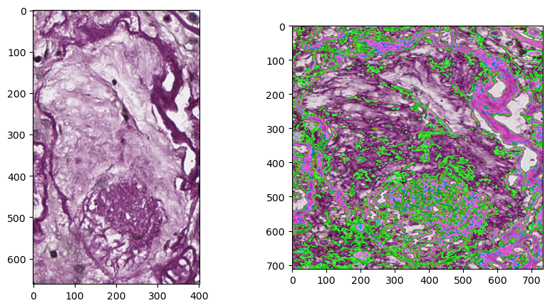

# Binary Classification of Globally Sclerotic and Non-Sclerotic Glomeruli

## Intro

---

Glomerulosclerosis is scarring of the tiny filtering units inside the kidneys (glomeruli). This causes a loss of protein into the urine. These proteins help fluid stay within the blood vessels. Without them, fluid leaks into the nearby tissue and causes swelling.

Scarred glomeruli can't be repaired. Treatment aims to prevent further damage and to avoid dialysis. The best treatment for glomerulosclerosis depends on what caused the scarring. The cause is determined by a kidney biopsy.

source: [https://www.hopkinsmedicine.org/health/conditions-and-diseases/glomerulosclerosis](https://www.hopkinsmedicine.org/health/conditions-and-diseases/glomerulosclerosis#:~:text=points%20about%20glomerulosclerosis-,Glomerulosclerosis%20is%20scarring%20of%20the%20tiny%20filtering%20units%20inside%20the,nearby%20tissue%20and%20causes%20swelling)

Our task in to determine whether a given whole slide biopsy image (WSI) is globally sclerotic or non-sclerotic. The contemporary [dataset](https://www.dropbox.com/scl/fo/ec4ez2yetlwzptjlzbp1q/h?rlkey=cy269u1aave2l3bupof6n189w&e=1&dl=0) comes from a large medical consortium. The task is implemented using PyTorch. The approach adopted for building and training the model is explained below in the Approach section. The steps to install and recreate the virtual environment required to train the model and evaluate on any given folder path is given below.

## Installation

---

Users can follow these steps to recreate the virtual environment and then train the model or evaluate the model on any given path. We start with creating a conda environment in the directory of the project.

- Clone the repo:

```shell
git clone https://github.com/AnishTatke/CMILImageClassification
cd CMILImageClassification
```

- Create a empty conda environment in a folder at the root path of the project directory. We install all the libraries and dependencies given in the [environment.yml](environment.yml) file into the newly created environment using the `-f`  flag.

```shell
mkdir env
conda env create -p env/ENV_NAME/ -f environment.yml
```

- Activate the environment by running the following command:
```shell
conda activate env/ENV_NAME
```

## Approach

---

The contemporary dataset contains **5758** images of WSI kidney biopsy images. The number of images in each class is given as follows:

- **Globally Sclerotic Images**: 1054
- **Non-Globally Sclerotic Images**: 4704

### Preprocessing

For code and analysis, please refer to [DataAnalysis](DataAnalysis.ipynb) for understanding why and how preprocessing was done

Thus we see that there is an obvious class imbalance and we need to resolve that issue before or while we train the model on the given dataset.

Lets load all images and log their shapes. We need to check if any preprocessing is needed on the images before the are trained/evaluated. The below given histogram shows the distribution of the widths and heights of all the images.


The images have arbitrary sizes and we need to resolve that problem before we train the images. Another additional point to be noted is that each image is in the CMYK format (4 channels). We can experiment further to see if we need to convert the format into something more feasible or not.

We formulate a preprocessing approach using `torchvision` ’s transforms library which provides various transformations and preprocessing functions for images. To solve the issue of arbitrary sizes, we rescale our images to the mean width and mean height of all images. We will save these values for future use in a [json file](data/rescaling_config.json). The mean width and height values of our dataset are calculated are given below:

- **Mean Width**: 711
- **Mean Height**: 733

The rescaling is followed by Normalization while is necessary to bring all values between a given mean and standard deviation. We normalize each image with

- **Mean**: [0.5, 0.5, 0.5, 0.5]
- **Standard Deviation**: [0.5, 0.5. 0.5 0.5]

Lastly we convert the rescaled and normalized images into Tensors and prepare the images in batches. An example of how the images look like before and after preprocessing:



### Data Splitting and Training Preparation

We implement a conventional 80-20 split on our data. The dataset is randomly permuted before splitting into the training and validation sets. The number of images distributed in each set are given as follows:

- **Training Set**: 4606
- **Validation Set**: 1152

The next step is to create data loaders for collating and creating batches of training images. Here we address the issue of class imbalance. Our goal here is to sample the images with probabilities such that our model is trained on images of both classes equally. Hence we use the PyTorch’s [`WeightedRandomSampler`](https://pytorch.org/docs/stable/data.html#torch.utils.data.WeightedRandomSampler)  which samples images given the probabilities/weights.

A simple strategy to calculate the probabilities is counting up the number of examples of each class in the training set (stored in `class_sample_count`). Thus the class wise weights are given as:

```python
class_weight = 100. / class_sample_count
weights = np.array([class_weight[t] for t in labels])
```

The `weights` array contains the class weights for every training example according to the calculated probabilities in `class_weight` . We then pass these weights as inputs to our `WeightedRandomSampler`  and pass this sampler to our data loader for training.

### Parameters

The following parameters were used for training the model and achieving the best model state.

- **Batch Size**: 32
- **Learning Rate**: 1e-3
- **Number of training epochs**: 5-10

### Model Architecture

The task requires our model to output a single value which ranges between 0 and 1. The model is fed the batched inputs which are in the shape of `[32, 4, 711, 733]` . The model architecture is given below as follows:

```markdown
----------------------------------------------------------------
        Layer (type)               Output Shape         Param #
================================================================
            Conv2d-1         [32, 16, 354, 365]           1,616
       BatchNorm2d-2         [32, 16, 354, 365]              32
              ReLU-3         [32, 16, 354, 365]               0
         AvgPool2d-4         [32, 16, 177, 182]               0
            Conv2d-5           [32, 32, 88, 90]           4,640
       BatchNorm2d-6           [32, 32, 88, 90]              64
              ReLU-7           [32, 32, 88, 90]               0
         AvgPool2d-8           [32, 32, 44, 45]               0
            Conv2d-9           [32, 32, 42, 43]           9,248
      BatchNorm2d-10           [32, 32, 42, 43]              64
             ReLU-11           [32, 32, 42, 43]               0
        AvgPool2d-12           [32, 32, 21, 21]               0
          Flatten-13                [32, 14112]               0
           Linear-14                  [32, 256]       3,612,928
      BatchNorm1d-15                  [32, 256]             512
             ReLU-16                  [32, 256]               0
           Linear-17                   [32, 64]          16,448
      BatchNorm1d-18                   [32, 64]             128
             ReLU-19                   [32, 64]               0
           Linear-20                    [32, 1]              65
================================================================
Total params: 3,645,745
Trainable params: 3,645,745
Non-trainable params: 0
----------------------------------------------------------------
Input size (MB): 254.47
Forward/backward pass size (MB): 1890.56
Params size (MB): 13.91
Estimated Total Size (MB): 2158.94
----------------------------------------------------------------
```

The model architecture contains three convolution blocks, a flatten layer and three fully connected blocks. Each block is explained below with its internal layers, their function in the model and how they help us distinguish between the binary classes.

- **Convolutional Block**: This block contains convolutional layers followed by normalization, activation and pooling layers.
    - **Convolutional Layer**: The convolutional layers [`nn.Conv2d`](https://pytorch.org/docs/stable/generated/torch.nn.Conv2d.html#torch.nn.Conv2d) performs various convolutional filters on the images. Each filter/kernel of specified size slides over the image with a given stride. We can also specify the number of filters to be used which is seen in the output of the layer as the number of channels.
    - **Batch Normalization**: This layer [`nn.BatchNorm2d`](https://pytorch.org/docs/stable/generated/torch.nn.BatchNorm2d.html#torch.nn.BatchNorm2d) is often used for normalizing the values in every batch. This helps the model evade from problems like exploding gradients and in-turn helps avoid overfitting over the training data.
    - **ReLU Activation**: We use the ReLU activation [`nn.ReLU`](https://pytorch.org/docs/stable/generated/torch.nn.ReLU.html#torch.nn.ReLU) function in every intermediate convolution/fully connected block.
    - **Average Pooling**: We perform average pooling [`nn.AvgPool2d`](https://pytorch.org/docs/stable/generated/torch.nn.AvgPool2d.html#torch.nn.AvgPool2d) using a 2x2 filter which reduces the size of the images by a factor of 2. In average pooling, a 2x2 filter slides over the images and the average value of the 2x2 values are replaced in the place of the position of the filter.
- Fully Connected Block: After the convolutions are done, the model flattens the output from the convolutional layers and builds a fully connected network over the flattened outputs.
    - **Linear Layers**: The Linear layer [`nn.Linear`](https://pytorch.org/docs/stable/generated/torch.nn.Linear.html#torch.nn.Linear) defined the fully connected network in which each neuron performs the operation of
        
        $$
        y_i = \sum_{i}^{N} W^Tx_i + b
        $$
        
    - **Batch Normalization**: In the fully connected network the batch normalization is performed in 1D [`nn.BatchNorm1d`](https://pytorch.org/docs/stable/generated/torch.nn.BatchNorm1d.html#torch.nn.BatchNorm1d) rather than 2D
    - **ReLU Activation**: We use the ReLU activation [`nn.ReLU`](https://pytorch.org/docs/stable/generated/torch.nn.ReLU.html#torch.nn.ReLU) function in every intermediate convolution/fully connected block.

### Loss and Optimization

The model is trained for 10 epochs while using the PyTorch’s [`nn.BCEWithLogitsLoss`](https://pytorch.org/docs/stable/generated/torch.nn.BCEWithLogitsLoss.html#torch.nn.BCEWithLogitsLoss) . We choose the this loss function over the [`nn.BCELoss`](https://pytorch.org/docs/stable/generated/torch.nn.BCELoss.html#torch.nn.BCELoss), as the `nn.BCEWithLogitsLoss` is numerically more stable and combines the `sigmoid` with the `nn.BCELoss`. We also specify the `pos-weight`  parameter on the loss function initialization which helps us calculate a weighted loss to handle the class imbalance issue. The optimizer used is Adam optimizer and a learning rate of 1e-3 (0.001) is used.

## Training and Validation

---

The training is done in the [CNNRun Notebook](CNNRun.ipynb)

We observe the performance of the model with various values of learning rate, batch sizes and other architectural modifications. The model performs well, achieving a training accuracy of around 97% near the 5th epoch. The model gives a validation accuracy of 96% at the same state of the model.

The below given graph shows the performance of the model in terms of the increase in accuracy and decrease in loss value.


This shows that the model performs well with our specified hyperparameters. We also try to evaluate the model based on other evaluation metrics. Here we display the confusion matrix which helps us understand our model better.


The model makes 39 mistakes when fed with 1152 validation examples. We can also note where the model predicts incorrectly and by how much

- The model predicts 28 globally sclerotic glomeruli as non-globally sclerotic.
- The model predicts 11 non-globally sclerotic glomeruli as globally sclerotic.

We also use the `sklearn` ’s classification report to note important evaluation metrics like precision, recall and F1-score which help us observe the accuracy and completeness of positive predictions. This is really helpful to see while validating is class imbalance issue is resolved correctly or not.

```text
                                  precision    recall  f1-score   support

non_globally_sclerotic_glomeruli       0.98      0.97      0.97       949
    globally_sclerotic_glomeruli       0.87      0.89      0.88       203

                        accuracy                           0.96      1152
                       macro avg       0.92      0.93      0.92      1152
                    weighted avg       0.96      0.96      0.96      1152
```

### Training Steps

The model is trained using the [train.py](train.py) script. To generate new model checkpoints, please run the train.py script in the command shell at the project’s path

- First navigate to the folder path where the repository is cloned. We first activate our environment by running the following command.

```shell
conda activate env/ENV_NAME
```

- Next we can run the [train.py](train.py) file in the shell. Just run the command:

```shell
python train.py
```

This will generate a `model.pth` file at the path [`models/`](models). The evaluation script uses the same model from this path to evaluate WSI images.
Alternatively you can download the model from [Google Drive](https://drive.google.com/file/d/1LzNBrRKyZDF3nzxY5CMFZNX7cX6w9cLP/view?usp=sharing) and save it in the project directory under [`models/`](models) path.

## Other Experiments

---

Here we delve into steering away from conventional image classification approaches like Convolutional Layers and experimenting with novel architectures which are used in AI today. Especially generative models which help us understand context of texts and images better.

We try to implement the Vision Transformers on our data and fine tune on the base model developed by Google. The preprocessing needed in this approach is different from the one explained above. We extensively use the Hugging Face Hub and its classes/functions to implement the fine-tuning.

Refer the notebook [VisionTransformer](VisionTransformer.ipynb) to see further installations needed to implement the fine-tuning process. The fine-tuned model is not included in the final [evaluation.py](evaluation.py) script as it’s performance is almost similar to our CNN model.

## Inference

---

To evaluate the model on images at any given path, we first activate the conda environment in the shell by running commands given in Training Steps section. Next we run the [evaluation.py](evaluation.py) script along with specifying any path that contains the patched glomeruli WSI biopsy images. The script generates a evaluation.csv file.

```shell
python evaluation.py PATH
```

In case of specifying an invalid path, the script outputs a string “Invalid path”. The evaluation.csv file is generated in the shell’s current working directory. The csv contains two columns given as “*name*” and “*prediction*”.
